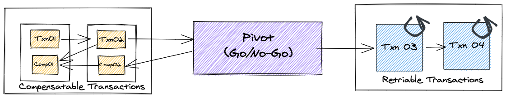

## Learning Sagas Step by Step

### Role of Transactions and How Does Happen in Distributed System Architecture

The concept of transaction is extremely important in achieving data consistency. Transactions in the form ACID (Atomicity, Consistency, Isolation and Durability) are the best perceived form of transactions that developers are used to deal with. ACID transactions provide definitive means to how to manage data while a transaction is in play and preserves the ACID properties.  When the data is local to a single system backed by may be one or few data stores, ACID can be implemented pretty seamlessly. In Java and Spring World, we are so use to the  Transactional Specification of Java EE and Awesome AOP based Spring Implementation of Transactions (@Transactional). 

While ACID is great, it is a bigger challenge to implement it in the context of distributed systems. The term Distributed Transactions sounds to be the solution for this. Essentially the idea is to have a Distributed Transaction Manager (Coordinator) that can coordinate transactions across multiple systems and ensure that transaction is performed only with consensus of all all participants. This orchestration is not that simple and not all that efficient in distributed world. Its gets even further complicated when participating systems operate asynchronously and event driven fashion.

### Distributed Transactions - Can it be done or what are the challenges?

The defacto standard for Distributed Transactions is Open XA (Extended Architecture) which uses the concept of Two Phase Commit. For XA Transactions to be implemented, it require the participating data stores to be XA Compliant. Most SQL databases (Oracle) and legacy message brokers (MQ) are XA compliant. If we are building our distributed systems in an ecosystem which is fully XA compliant, implementing Distributed Transaction may truly be possible. There are frameworks such as Atomikos and Narayana which provides Distributed Transaction Management implementations as well. But...

#### Challenge 01:  Modern databases and messaging systems  are not  XA compliant

When building distributed systems in modern world, you would want to use different data stores and messaging brokers based on the the need. You want to use a NoSQL Database like Mongo, Cassandra or Neo4J or use a messaging system like Kafka or RabbitMQ for that matter. None of these would support XA Transactions which means you cannot apply Distributed Transaction solution when these data stores and messaging systems are involved.

##### Challenge 02: You can ONLY choose Consistency Over Availability with XA Transactions in place

What does it mean by that? If you apply CAP Theorem to a Distributed System, we know that Partition Tolerance is a given, which means we need to trade-off between Consistency and Availability and pick one, because achieving both is not possible. In building micro-services for example, we often would want to select Availability over Consistency in many of the use cases. Some form inconsistency in the system is tolerable but not the loss of availability as it could very well mean loss of business. Now, with XA transactions, suddenly you don't really have a choice in the matter. If a transaction is in play, for it to succeed all participant must be available at that given point in time. Even if a single participant is unavailable, the transaction would fail to commit. This means that as the number of distributed components participating in a transaction grows, the availability of that operation goes down. This is a major concern in XA transactions that simply puts the XA Transaction out of place in the Micro-service Architecture.

Apart from these main two challenges, performance and scalability also becomes a factor against going XA as it requires synchronization and isolation to ensure ACIDity of operations. Also, many business functions are asynchronous and may also be long running in which case, this strategy of holding resources would not make sense.

If not Distributed Transactions, then ... ? Lets talk about Sagas next.

### What is a Saga?

Sagas are essentially a sequence of local transactions that are executed in a distributed system. Each local transaction is performed by  a single service. The sequence of these local transactions must be coordinated in order to complete the overall work. That can be achieved in two ways: Using Choreography (Every Participant knows how to coordinate with other participants to get the job done) OR Using Orchestration (Central Coordinator performs the Saga).

However... 

Sagas does not provide I in ACID transactions (Sagas by nature are ACD Only).  Isolation means that a transaction should always be performed in isolation not affecting other transactions and it should look like all events of a transaction happened in sequence. And the changes made within the transaction should not be visible to other transactions before it completes. This is not possible with Sagas because all local transactions get committed before the entire saga completes. This means that there could be anomalies that could occur in the system such as: 

- Loss of Updates - Due to multiple sagas concurrently executing on same data
- Dirty Reads - Due to local transactions getting committed, readers may be able to data in a state that is not overall consistent due to the Sagas that are still in progress.
- Non-Repeatable Reads / Phantom Reads - Again due to concurrent execution of Sagas, the state of data of a particular row or table may change and return different results to the same query between steps.

Also, unlike Transactions which provide a boolean signal to all participants to either Commit or Rollback, the same would not be possible for a Saga. In a Saga, each local transaction needs to be completed before the next begins, and so on and so forth. Which means, if something happens to a single transaction in the middle of the Saga, there is not boolean signal to rollback all that is done so far and go back to Zero. Remember, all participants of a Saga are distributed and they work on their own data stores. Therefore the rollback is handled differently in Sagas. 

#### Compensating Transactions

Each participants of a Saga should provide a mechanism for performing a compensating transaction that brings that the system back to a consistent state when applied. This is an important aspect of the contract that a Saga Participant need to adhere to. Whenever a Saga Transaction encounters an error while being in-progress, it will start the compensation process as the means to bring the system back a consistent state.

Compensating Sequence of a Saga would be in the reverse order of the normal execution of Saga and would begin from the step before the one that just failed. In S1 -> S2 -> S3 -> S4 sequence of Saga, if a failure happens in S4 step, Compensating Sequence of C3 -> C2 -> C1 will be executed.

Do all steps of a Saga need a Compensating Transaction? Answer would be No. At times a step in a Saga would be a Read-Only operation of some sort that does not change the state of the overall system. Such steps does not require a compensating transaction. 

As discussed before, there are two ways in which Saga Pattern can be implemented, which are `choreography` and `orchestration`.  While they are self explanatory terms, lets compare how they can be implemented in a micro-service architecture to get a better understanding.

- Choreography 

Choreography based Sagas are executed through message passing between micro-services. There is no central coordinator doing all the work. If you are already subscribed to the idea Domain Driven Design and Event Driven Architecture and follow the concepts such as Domain Events, the micro-services you build would already be publishing domain events and listening the other interested domain events. That foundation can be the base of a Choreographic Saga implementation as well, where micro-service work with each other in a self driven, self observatory scale to conduct Sagas. It makes things simpler in that context and remove the need of an orchestrator. Also you are able to achieve maximum loose coupling between micro-services by doing that. 

However, as Sagas become complex, this  style of Saga execution becomes difficult to manage and monitor. There could be many events that micro-services would have to listen to in order to make sure they perform their transactions aligning to them. It could also lead to cyclic relationship and slowly created unwanted coupling between systems if to managed properly.

- Orchestration 

You will need Orchestrator to conduct the Saga Transaction. It would ensure that the step sequence is followed and initiates rollbacks as required and etc. This Saga Orchestration can be done within a micro-service itself or it can be delegated to a separate orchestration engine or workflow engine. This decision is a critical but depends on the complexity of the Saga use-cases that you require to support in your architecture. Chris Richardson in his book `Microservice Patterns` recommends to use orchestration for all use-cases except for the simpler ones.

Orchestration based Sagas provides more simplicity and understanding specially in case of complex Sagas. Also its easier to define the Saga Sequence and monitor their progress from a single point of execution. However, we should be mindful not to leak too much business logic that actually belongs to participants into the Orchestrator itself.

Now, Sagas are Sequence of Local Transactions. There are 3 kinds of Transactions, and those are:

- Compensatable Transactions
- Pivot Transactions
- Retriable Transactions

The following diagram explain it a bit more.

So the simple idea is here is the Saga can go through a set of Compensatable Transactions before reaching a Pivot Transaction. Once Pivot Transaction is reached, a decision of whether the Saga is successful or not would be taken. If successful, it will proceed further to any pending retriable transactions from that point. If any transactions post pivot point fails, they would retried until they would be made successful (since they are guaranteed to completed) in order to complete the Saga.

### How to Handle Lack of Isolation

There are several ways to manage the lack the isolation and the side effects of the inconsistent reads and loss of updates.

First idea that is generally discussed is to use some sort of locking mechanisms. In regular transactions, we are used to Optimistic and Pessimistic Locks and the same can be applied in the context of Saga. The idea is that an record that is currently being operated on by a Saga that is in process is not allowed to be concurrently updated through introduction of Locking. This prevents loss of updates due to concurrency of multiple saga executions (concurrent sagas updating account balance for example). When we compare Pessimistic vs. Optimistic locking, obviously Optimistic is the way to go, given that is is far more performant compared the other. However, this would mean that Saga Participant may often encounter concurrent modification related failures. It is not a real transaction failure in terms the Saga (Retriable) and therefore participants must attempt to retry until the local transactions are successful.

Other forms of locks are referred to as Semantic Locks which are indicators that you need to maintain within the business data tables that reflects the state of it. Such Semantic Locks can be used by the business logic to make decisions on how to proceed with any new Saga Transactions or any other requests that attempts to involve with the particular data. For example, when an order is in progress, depending it's `status`, Cancellation API can take decisions whether the Order can be allowed to cancel or not. For example, when order is in `PENDING` status, it may accept it, where as when the status is moved to `SHIPMENT_READY` or `SHIPMENT_COMPLETE`, it may reject any cancellations. If you want to achieve full serializability of Order entity in this example, you can achieve that with Semantic Locks. You do that by rejecting any attempts to modify the status of Order entity by any other Saga or other means until the current Saga is completed. Such serializability will simplify the Saga implementations, but it may not always be the case based on the business need. 

Similarly semantic locks can help readers be notified the record's volatility. For example, if a Transaction is in progress, Account's Current Balance may be volatile across multiple reads and that can be captured with an indicator flag. If the reader wants to stable current balance, it may have to repeat until the transactions complete to get a consistent value or treat the current value with the consideration of all pending transactions. For example, if customer wants to initiate a transaction while he has many pending other transactions in place, sufficient balance calculation for the account must consider all pending transactions as well. 

**Don't Let Compensations Over or Under Compensate**

In terms of Isolation, one of the main factors to consider is how we design compensation of our own participant logic. The motive of compensation is to bring a particular part of the overall data involved in a Saga back to a consistent state. Therefore it needs to be extra-cautious on how compensation logic is performed. Simplest example is how an account is credited if a particular payment is canceled. Compensation should ensure that most recent balance of the customer is credited with the exact withheld amount (Ensure no loss of updates). Sometimes compensations is simply reversing an operation already performed, but it not always the case. However, one thing for sure. We need to identify all compensatable transactions and ensure that there is a compensation logic defined for it. Otherwise it defeats the entire purpose of using Sagas to solve this problem in the first place.

Given the concurrency and distributed nature of it, isolation is one of the toughest challenges that remain in the Saga Pattern implementation. It requires an extensive design thought process to determine how each use case will be handled with different strategies in a case by case basis.

Finally, the concept of Sagas and its adoption in the microservices landscape is a topic that is extensively discussed in the community. `Chris Richardson`'s `Microservices Patterns: With Examples in Java` is one of the best literature for this which was the primary source of my readings as well in writing this. 

While there are many frameworks and products that can help build Saga Transactions for Micro-services, the two Java based libraries that comes up are Eventuate (by Chris Richardson and his team), and Axon Framework. Other frameworks such as Eclipse Microprofile LRA, Spring Statemachine are also candidates which can support Saga development. Apart from those, we also have different workflow engine products that could provide Sagas.

Therefore technology selection would be next biggest challenge once you determine you need Sagas. I am currently learning about some of this frameworks to get a better understanding of them and hopefully I can document my learnings as I make progress.

Finally I have listed few references that I have found through my research.

## References

- Microservice Patterns by Chris Richardson - https://www.google.com/books/edition/Microservices_Patterns/QTgzEAAAQBAJ?hl=en&gbpv=1&printsec=frontcover
- Saga Whitepaper: https://www.cs.cornell.edu/andru/cs711/2002fa/reading/sagas.pdf
- Presentation on Sagas: https://www.redhat.com/files/summit/session-assets/2019/T42224.pdf
- Atomikos Distributed Transaction Manager - https://www.atomikos.com/Blog/TransactionalRESTMicroservicesWithAtomikos
- Other interesting reads - 
	- https://www.ufried.com/blog/limits_of_saga_pattern/
	- https://itnext.io/newscast-using-sagas-in-choreography-and-orchestration-patterns-a-java-17-and-kotlin-example-e3d0ec17b910

Frameworks:

- Eventuate Tram - https://eventuate.io/abouteventuatetram.html
- Axon - https://axoniq.io/product-overview/axon-server
- Ecliplse LRA - https://github.com/eclipse/microprofile-lra
- Spring StateMachine - https://projects.spring.io/spring-statemachine